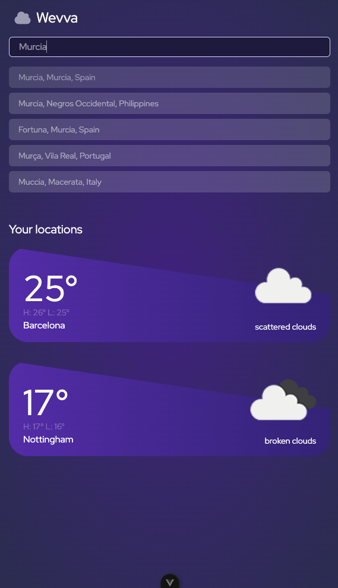
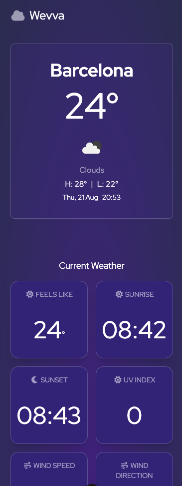
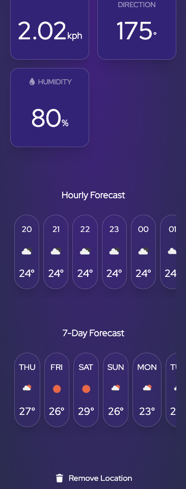

# Proyecto de Clima y Mapas

Aplicación web que permite visualizar ubicaciones en un mapa y consultar datos meteorológicos en tiempo real.  
Construida con **Vue 3**, **Vite**, **TailwindCSS** y APIs externas (Mapbox y OpenWeather).

## Características

- Visualización de ubicaciones en mapas interactivos usando **Mapbox**.
- Consulta de información meteorológica actual mediante **OpenWeather API**.
- Interfaz responsive y moderna gracias a **TailwindCSS**.
- Manejo de estados de carga con **Vue Suspense** y componentes skeleton.

### Imagenes






### Enlaces

- Live Site: https://vue-weather-app-psi.vercel.app/
- Github: https://github.com/smartinuk88/vue-weather-app

## Requisitos Previos

Asegúrate de tener instalado:

- [Node.js](https://nodejs.org/) (versión 18 o superior recomendada)
- [npm](https://www.npmjs.com/) o [yarn](https://yarnpkg.com/)

## Configuración del entorno

Para ejecutar el proyecto en tu máquina local, debes crear un archivo `.env` en la raíz del proyecto con las siguientes variables de entorno:

```env
VITE_MAPBOX_API_KEY=tu_api_key_de_mapbox
VITE_OPENWEATHER_API_KEY=tu_api_key_de_openweather
```

Sustituye tu_api_key_de_mapbox y tu_api_key_de_openweather por tus claves personales de cada servicio.

Ejecución en local
Clona el repositorio:

```bash
git clone https://github.com/tu-usuario/tu-repo.git
cd tu-repo
```

Instala las dependencias:

```bash
npm install
```

o si usas Yarn:

```bash
yarn install
```

Inicia el servidor de desarrollo:

```bash
npm run dev
```

o:

```bash
yarn dev
```

Abre el navegador en http://localhost:5173

## Author

- Website - [Scott Martin](https://www.scottmartinwebdevelopment.com)
